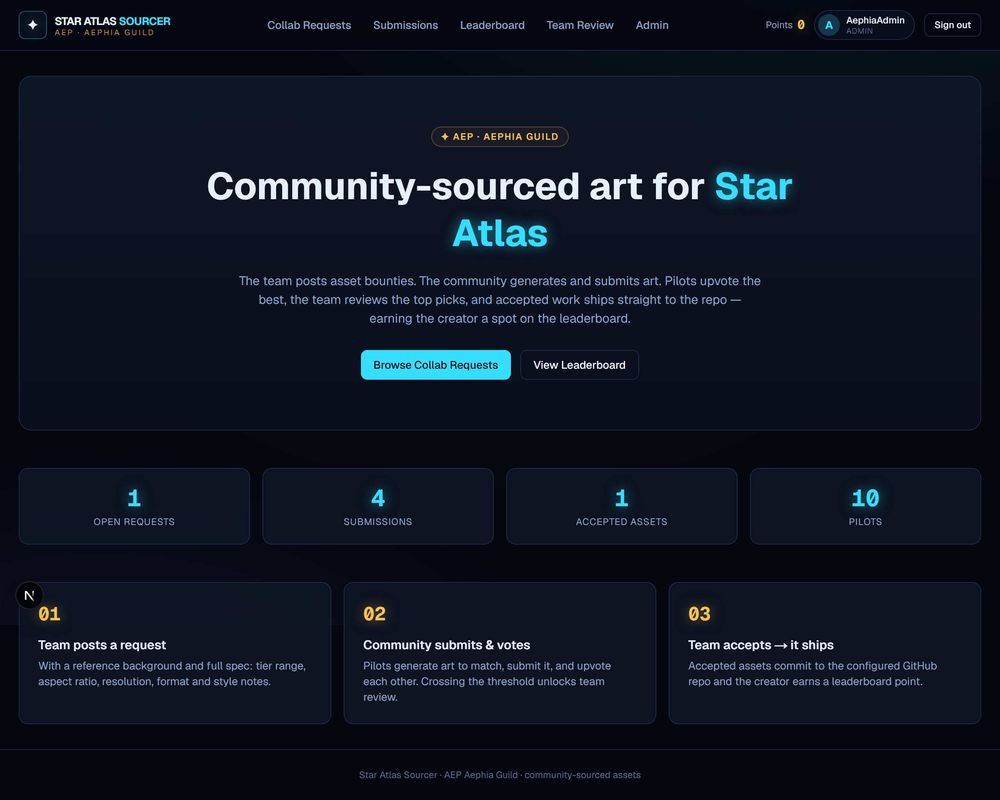
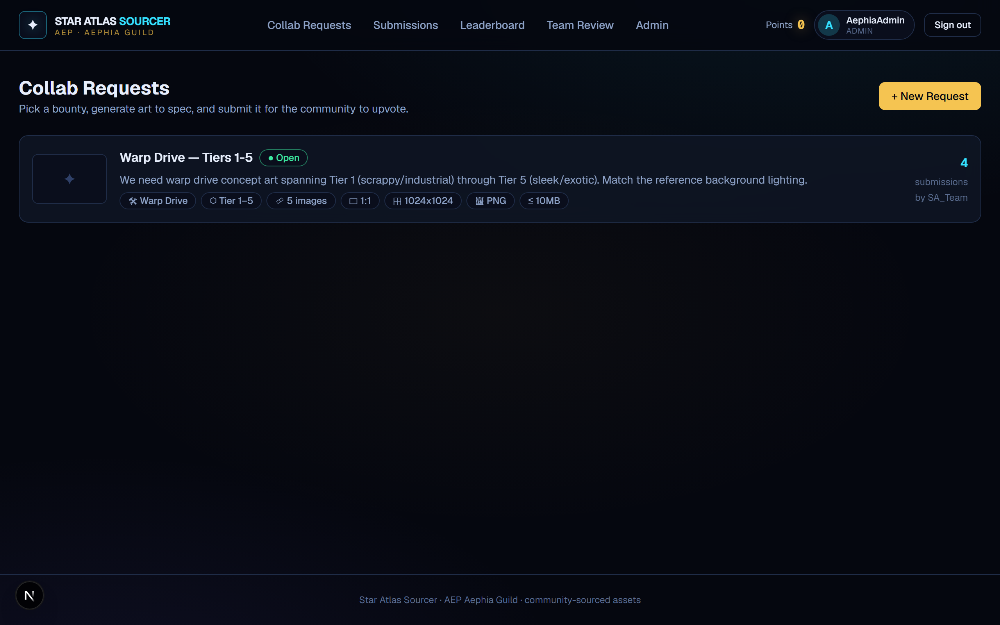
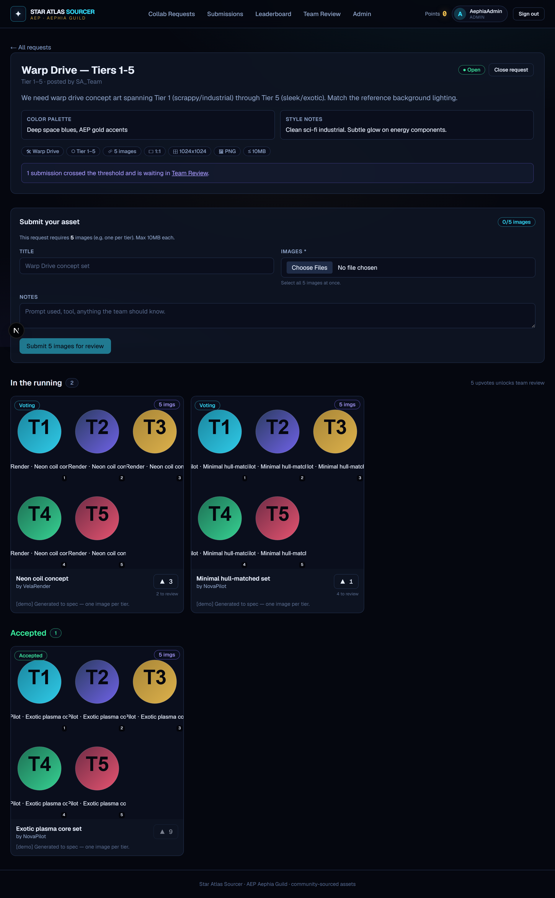
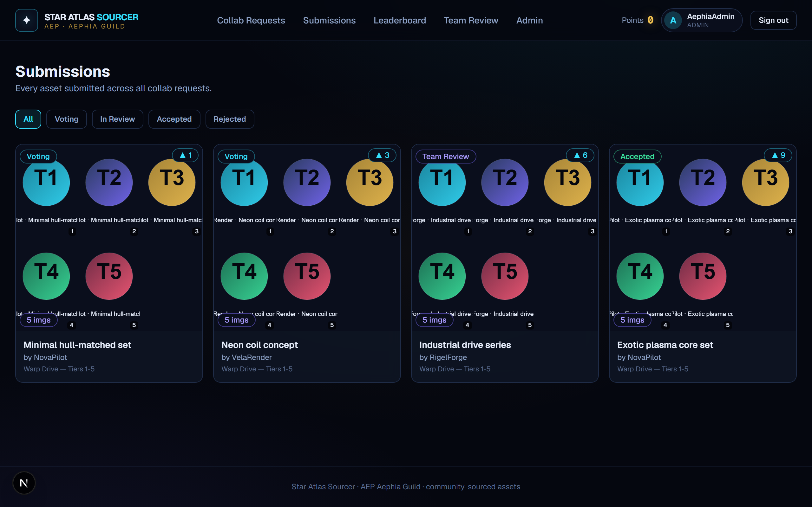
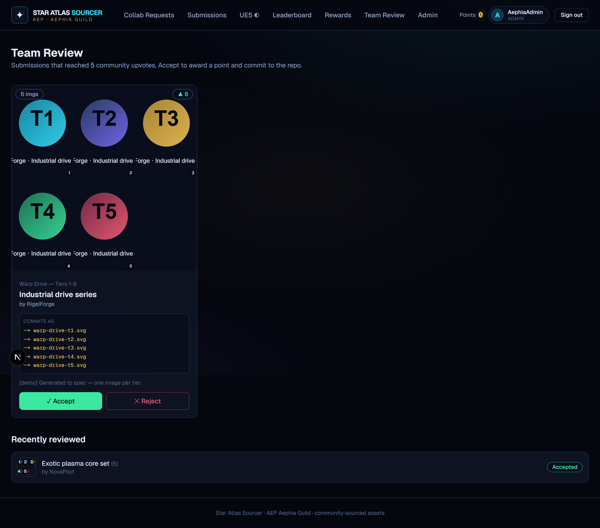
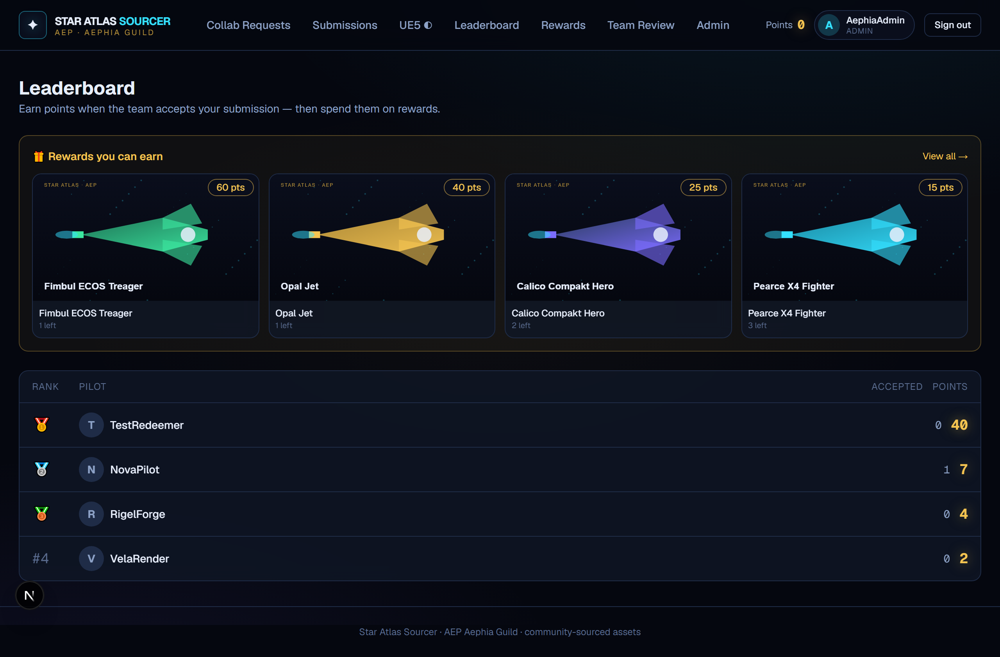
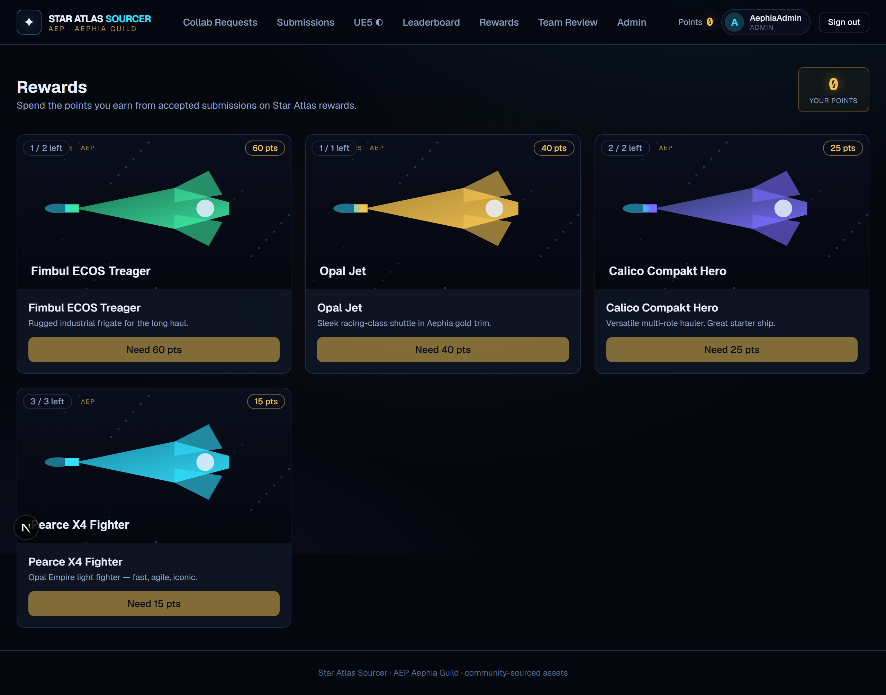
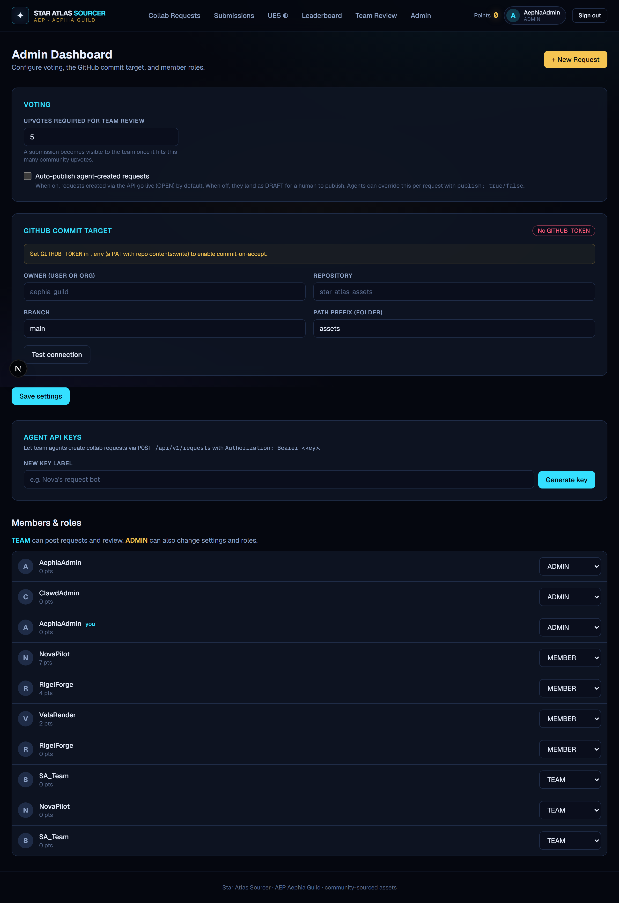
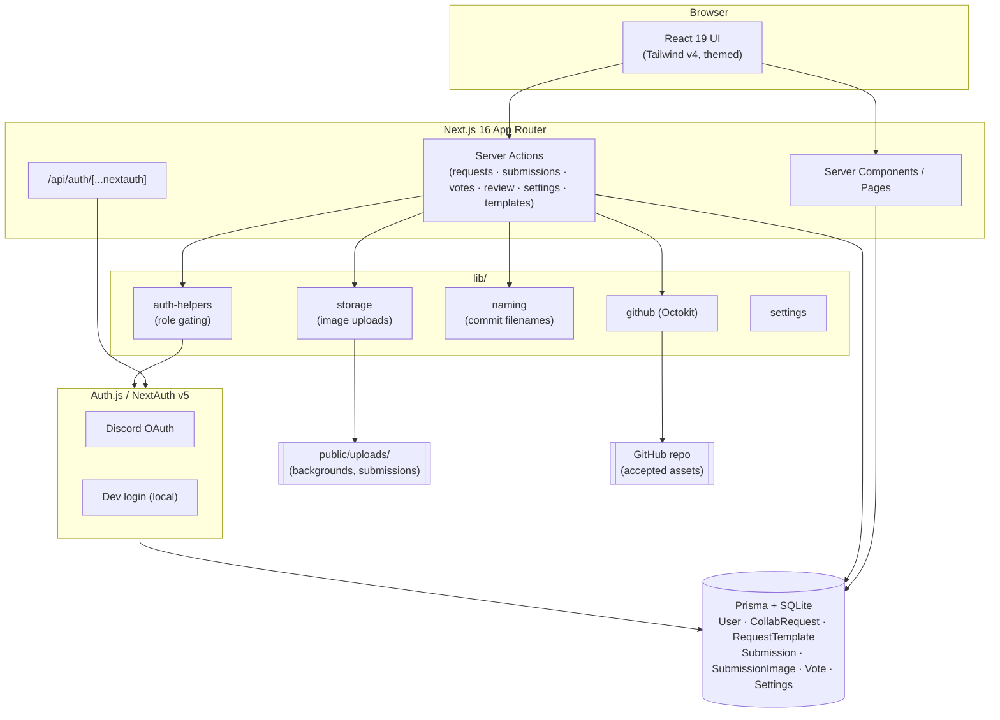
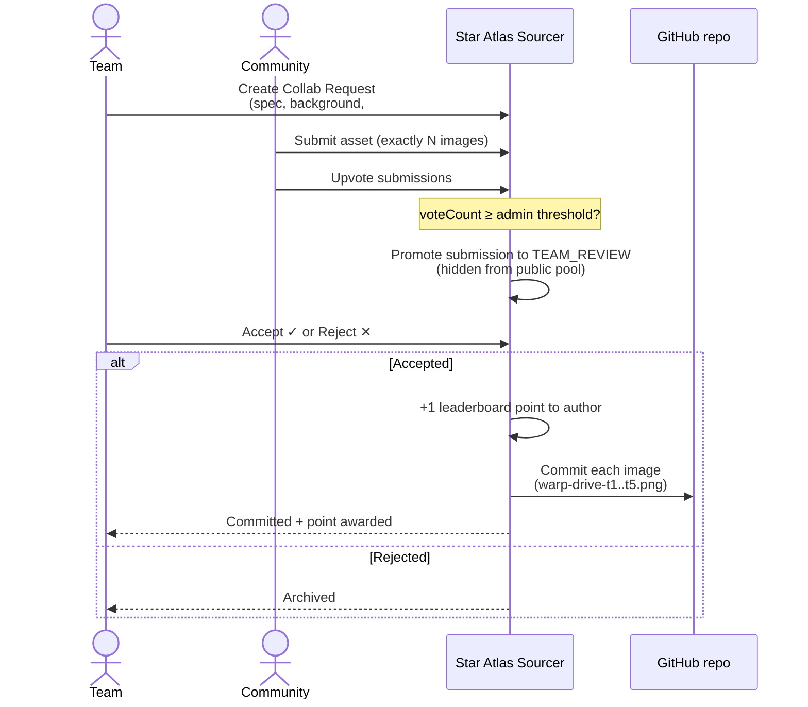

# Star Atlas Sourcer

### 📄 [**→ View the Pitch Deck (PDF)**](docs/StarAtlasSourcer-Pitch.pdf)
> An 11-slide overview for ATMTA / Star Atlas management. _(Regenerate with `npm run deck`.)_

---

A community-sourced asset bounty & review pipeline for **Star Atlas**, themed for the **AEP / Aephia guild**.

The team posts asset bounties → the community generates and submits art → pilots upvote → submissions that
cross a configurable threshold enter team review → accepted assets are committed to a GitHub repo and the
creator earns a leaderboard point.

## Demo

> Screenshots are generated from seeded demo data — see [Regenerating the docs](#regenerating-screenshots--docs).



<table>
<tr>
<td width="50%"><strong>Collab Requests</strong><br/></td>
<td width="50%"><strong>Request detail (submit + vote)</strong><br/></td>
</tr>
<tr>
<td width="50%"><strong>Submissions gallery</strong><br/></td>
<td width="50%"><strong>Team Review</strong><br/></td>
</tr>
<tr>
<td width="50%"><strong>Leaderboard</strong><br/></td>
<td width="50%"><strong>Rewards (redeem with points)</strong><br/></td>
</tr>
<tr>
<td width="50%"><strong>Admin dashboard</strong><br/></td>
<td width="50%"></td>
</tr>
</table>

## Architecture



## How it works (flow)



## Stack

- **Next.js 16** (App Router, Server Actions, Turbopack) + **React 19** + **TypeScript**
- **Tailwind CSS v4** — custom Star Atlas / Aephia dark theme
- **Prisma 6 + SQLite** (local-first; swap the datasource for Postgres later)
- **Auth.js / NextAuth v5** — Discord OAuth, with a local **dev login bypass**
- **Octokit** — commits accepted assets to a configured GitHub repo
- Local file storage under `public/uploads/`

## Roles

| Role | Can |
|------|-----|
| **MEMBER** | submit assets, upvote submissions |
| **TEAM** | + post collab requests, review threshold-passed submissions |
| **ADMIN** | + change settings (upvote threshold, GitHub target), manage roles |

## Getting started

```bash
npm install
cp .env.example .env        # then edit values (an .env with dev defaults is already present)
npx prisma migrate dev      # creates the SQLite db
npm run db:seed             # seeds Settings + sample users + a sample request
npm run dev                 # http://localhost:3000
```

### Sign in (local)

`ENABLE_DEV_LOGIN="true"` (default) shows a **Dev sign-in** on `/signin` — pick any username and a role
(MEMBER / TEAM / ADMIN) without needing Discord. **Set it to `false` in production.**

### Enable Discord login

1. Create an app at <https://discord.com/developers/applications>
2. Add redirect URI: `http://localhost:3000/api/auth/callback/discord`
3. Set `AUTH_DISCORD_ID` and `AUTH_DISCORD_SECRET` in `.env`

### Enable GitHub commit-on-accept

1. Create a Personal Access Token with **repo contents: write** access
2. Set `GITHUB_TOKEN` in `.env`
3. In the **Admin** dashboard, set the owner / repo / branch / path prefix and click **Test connection**

When the team accepts a submission, the image is committed to
`<owner>/<repo>/<pathPrefix>/<asset>-<author>-<id>.<ext>` on the chosen branch.

## How the flow works

1. **Team** posts a Collab Request on `/requests/new` — title, description, asset type, tier range, and a
   spec template (aspect ratio, resolution, format, max file size, color palette, style notes) plus an optional
   reference **background** upload.
2. Requests appear on **`/requests`**. A member opens one and submits an image on the detail page.
3. Submissions gather **community upvotes**. When a submission reaches the admin-set threshold it is promoted to
   **TEAM_REVIEW** and removed from the public voting pool.
4. **`/team`** shows the review queue. **Accept** → author gets a point + GitHub commit; **Reject** → archived.
5. **`/leaderboard`** ranks pilots by points.

## Scripts

| Script | Purpose |
|--------|---------|
| `npm run dev` | dev server |
| `npm run build` / `npm start` | production build / serve |
| `npm run db:migrate` | run Prisma migrations |
| `npm run db:seed` | seed sample data |
| `npm run db:studio` | open Prisma Studio |
| `npm run db:reset` | reset the database |
| `npm run demo:seed` | add placeholder demo submissions (for screenshots) |
| `npm run screenshots` | regenerate README screenshots (server must be running) |

## Project layout

```
app/
  actions/        server actions (requests, submissions, votes, review, settings)
  requests/       list, detail (+ submit/vote), new
  team/           review queue
  admin/          settings + role management
  leaderboard/    rankings
  signin/         auth page
auth.ts           NextAuth config (Discord + dev login)
lib/              prisma, auth helpers, storage, github, settings
prisma/           schema, migrations, seed
components/       Navbar, cards, badges, vote button
```

## Agent API (create requests programmatically)

Team members can let their agents/scripts create collab requests via a REST API authenticated with a
per-member **API key** (generated in the Admin dashboard → *Agent API keys*).

```bash
curl -X POST http://localhost:3000/api/v1/requests \
  -H "Authorization: Bearer sas_xxxxxxxx..." \
  -H "Content-Type: application/json" \
  -d '{
    "title": "Warp Drive — Tiers 1-5",
    "assetType": "Warp Drive",
    "imageCount": 5,
    "tierMin": 1, "tierMax": 5,
    "targetWeb": true, "targetUE5": false,
    "aspectRatio": "1:1", "resolution": "1024x1024", "format": "PNG",
    "backgroundUrl": "https://.../reference.png",
    "publish": false
  }'
```

- **`publish`**: `true` → goes live (OPEN); `false` → saved as **DRAFT** for a human to confirm on `/requests`;
  omit to use the admin default (*Auto-publish agent-created requests* toggle).
- `GET /api/v1/requests` (same auth) lists recent requests.
- Keys are stored hashed and shown once; revoke anytime in Admin.

### MCP (for Claude / LLM agents)

An MCP server ([`mcp/server.mjs`](mcp/server.mjs)) exposes `create_collab_request` and `list_collab_requests`
tools so an LLM agent can post requests conversationally. Add to your MCP client config:

```json
{
  "mcpServers": {
    "star-atlas-sourcer": {
      "command": "node",
      "args": ["<path>/StarAtlasSourcer/mcp/server.mjs"],
      "env": { "SAS_BASE_URL": "http://localhost:3000", "SAS_API_KEY": "sas_..." }
    }
  }
}
```

## Regenerating screenshots / docs

The diagrams above are inline [Mermaid](https://mermaid.js.org/) — edit them directly in this README and GitHub
re-renders them. **Keep the architecture & flow diagrams in sync whenever the model, routes, or flow change.**

Screenshots live in [`docs/screenshots/`](docs/screenshots) and are produced from seeded demo data:

```bash
npm run dev                 # in one terminal
npm run db:seed             # base data (settings, users, sample request)
npm run demo:seed           # placeholder submissions in varied states
npm run screenshots         # captures docs/screenshots/*.png via headless Chromium
```

Re-run `npm run screenshots` after any UI change so the README stays current.

## Notes / next steps

See [TODO.md](TODO.md) for the full roadmap and contributor task list.

- SQLite + local file storage is for getting started. For production, move the Prisma datasource to Postgres
  and uploads to object storage (S3 / R2 / Supabase storage).
- Future ideas: submission comments, per-request deadlines, on-chain point mapping, image dimension validation
  against the request spec, Discord role sync.
